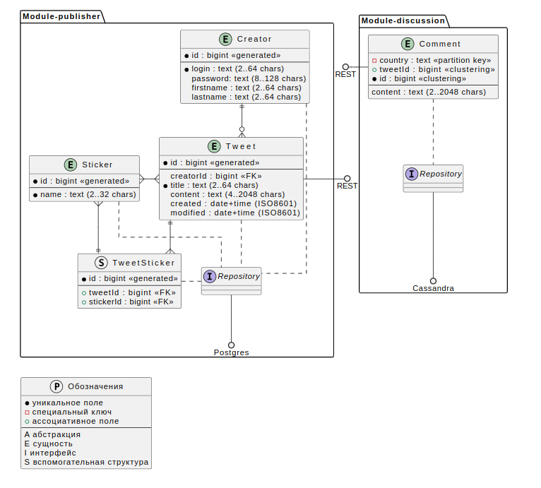

# Distributed computing

The main functionality is storing messages.

The goal of this project is to develop the service from a monolith into microservices, adding technologies for interaction and improving performance.

## Technology stack
- Java 21
- Gradle
- PostgreSQL
- Liquibase
- Testcontainers
- Mapstruct
- Mockito

## Goals
- [x] Create a monolith service for storing messages on PostgreSQL
- [ ] Split the monolith into microservices on PostgreSQL and Cassandra
- [ ] Add message broker Kafka for interaction between services
- [ ] Add Redis for caching
- [ ] Add docker-compose for running services

## Diagram

## Acknowledgments
I would like to express my sincere gratitude to **[Alexander Khmelov](https://github.com/Khmelov)**
for providing educational materials and the technical requirements that made this project possible.
